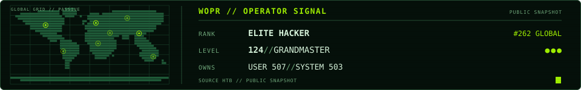

<!-- profile-console:start -->
<a href="https://app.hackthebox.com/public/users/6198">
  <picture>
    <source media="(prefers-color-scheme: dark)" srcset="./assets/signal-console-dark.svg">
    <source media="(prefers-color-scheme: light)" srcset="./assets/signal-console-light.svg">
    
  </picture>
</a>
<!-- profile-console:end -->

> **I trust boundaries I can inspect, automation I can audit, and claims I can reproduce.**

<p align="center">
  <a href="https://foobarto.me/blog/">blog/</a> ·
  <a href="https://foobarto.me/research/">research/</a> ·
  <a href="https://foobarto.me/disclosures/">disclosures/</a> ·
  <a href="https://foobarto.me/htb/">htb/</a>
</p>

## What connects the work

Most of my public work sits at the security-plus-AI-agents seam: isolated runtimes, explicit trust boundaries, capability-gated tools, and automation that leaves evidence behind. The pinned repositories are different implementations of that idea.

<!-- profile-signals:start -->
## Latest signals

```bash
curl -fsS https://foobarto.me/profile-signals.json | jq -c '.signals|sort_by(.date)|reverse[]'
```

- `2026-08-28` `writing` — [Ignorance Is a Security Boundary](https://foobarto.me/blog/2026/ignorance-is-a-security-boundary/)
- `2026-08-18` `disclosure` — [Remote-controlled VS Code command execution via an unsigned announcement feed in jlcodes.antigravity-cockpit](https://foobarto.me/disclosures/vscode-antigravity-cockpit-command-execution/)
- `2026-05-26` `research` — [Fluency as Attack Surface](https://doi.org/10.5281/zenodo.20397965)
- `2026-05-17` `htb` — [atlas — HTB machine writeup](https://foobarto.me/htb/machines/atlas/)
<!-- profile-signals:end -->

I take on focused security work: threat modeling, product and code review, AI-system review, and deep analysis of complex systems. See [consulting and contact details](https://foobarto.me/consulting/).
